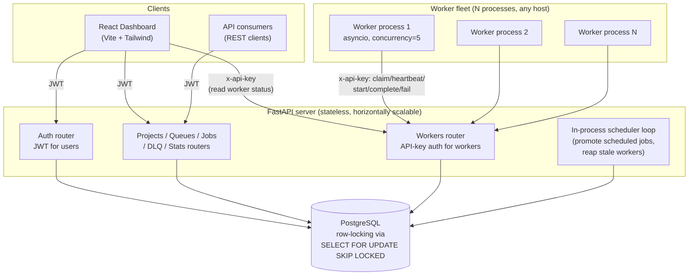

# Architecture

## System diagram

## Components

**FastAPI server.** Stateless — every request re-authenticates and reads/writes
Postgres directly, so any number of API server instances can run behind a load
balancer with no shared in-memory state. Two authentication schemes coexist by
design: dashboard users authenticate with a JWT (`Authorization: Bearer`),
while worker processes authenticate with a per-project API key
(`x-api-key` header). This separation matters because workers are unattended
long-running processes that shouldn't hold a short-lived user session, and
because it lets a project's API key be rotated independently of any one
person's login.

**Scheduler loop.** A single `asyncio` task inside the API process, started in
FastAPI's `lifespan` hook, that runs two idempotent jobs on a fixed interval:
promote `SCHEDULED` jobs whose `run_at` has arrived to `QUEUED`, and reap
workers that stopped heartbeating (marking them `OFFLINE` and requeuing
whatever they still held). Both operations are safe to run from more than one
API instance concurrently — the `UPDATE ... WHERE run_at <= now()` is a single
atomic statement, and reaping only touches jobs still owned by a worker whose
heartbeat is provably stale — so this does not need leader election to scale
past one API instance. A larger deployment would still likely split this into
its own small service so it can be scaled and restarted independently of HTTP
traffic; the design decisions doc covers that trade-off.

**Worker fleet.** Each worker is an independent OS process (`app/worker/runner.py`)
that can run on any machine with network access to the API. A worker:
1. Registers itself (`POST /workers/register`) to get a `worker_id`.
2. Loops: claims up to its free capacity via the atomic claim endpoint, and
   runs each claimed job as an `asyncio` task bounded by its concurrency limit.
3. Sends a heartbeat on its own timer, independent of the claim loop, so a
   worker busy with long jobs still reports liveness.
4. On SIGINT/SIGTERM: stops claiming new work, marks itself `DRAINING`, waits
   (up to a timeout) for in-flight jobs to finish, then reports `OFFLINE` and
   exits — jobs are never abandoned mid-execution by a clean shutdown.

Job business logic itself lives behind a small handler registry
(`app/worker/handlers.py`): adding a new kind of background job is "write one
`async def`, decorate it with `@handler("name")`" — nothing else in the
platform changes.

**PostgreSQL.** The single source of truth and the coordination mechanism for
claiming — see `docs/design-decisions.md` for why row-locking was chosen over
a separate broker/queue technology.

## Request flow: how a job actually gets executed

1. A client (dashboard or API consumer) `POST`s a job to
   `/projects/{p}/queues/{q}/jobs`. It's inserted with `status=QUEUED` (or
   `SCHEDULED` if it has a future `run_at`).
2. If it was `SCHEDULED`, the scheduler loop flips it to `QUEUED` once `run_at`
   arrives.
3. A worker's claim loop calls `POST /workers/{id}/claim`. The server runs a
   `SELECT ... FOR UPDATE SKIP LOCKED` scoped to that worker's subscribed
   queues, respecting each queue's `max_concurrency`, and flips matched rows to
   `CLAIMED` in the same transaction before releasing the lock.
4. The worker calls `.../start`, which flips the job to `RUNNING` and inserts
   a `JobExecution` row for this attempt.
5. The worker runs the registered handler for `job.name` with a timeout.
6. On success: `.../complete` records the result, flips the job to
   `COMPLETED`; if this was a recurring occurrence, the next occurrence is
   materialized from the cron template.
7. On failure or timeout: `.../fail` increments `retry_count`; if it's still
   within the retry budget, the job goes to `RETRYING` with `run_at` pushed
   out by the configured backoff (fixed/linear/exponential); otherwise it's
   moved to the `dead_letter_jobs` table.

## Deployment shape

- API server: any number of stateless instances behind a load balancer.
- Workers: any number of independent processes, on any host, scaled based on
  queue depth (see design-decisions.md for autoscaling notes).
- PostgreSQL: single primary is sufficient at moderate scale because all
  coordination is row-level; a read replica can offload the dashboard's
  stats/history queries if needed.
- Frontend: static build served from any CDN/static host, talking to the API
  over HTTPS.
