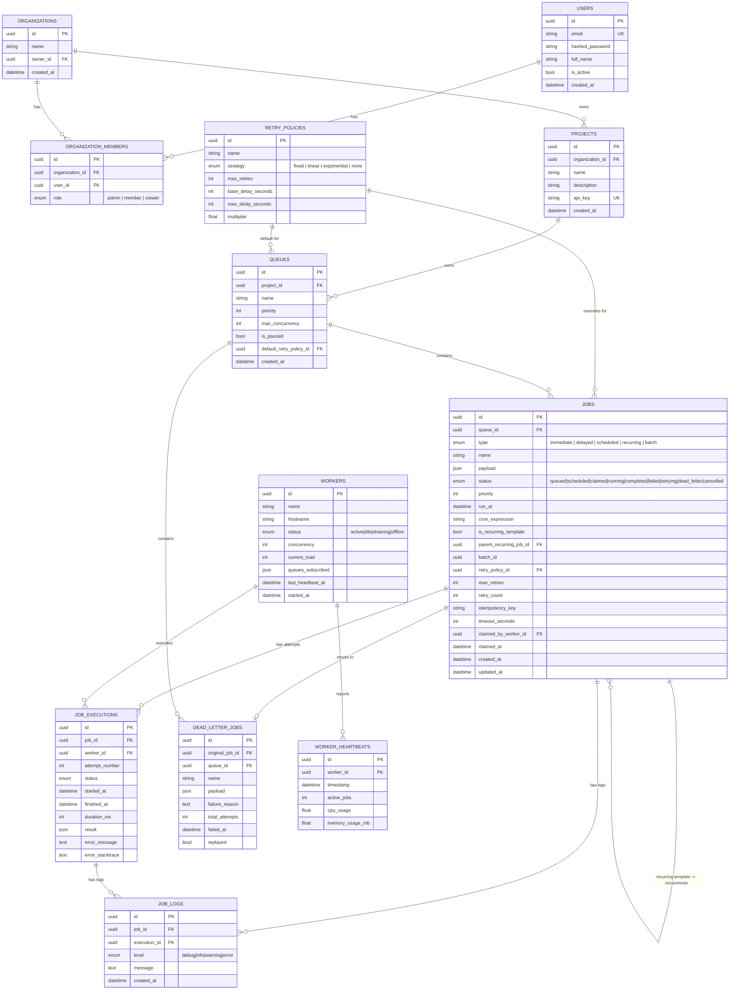

# Entity-Relationship Diagram

This diagram reflects the actual schema in `backend/app/models.py`. All primary
keys are UUIDs generated application-side; all foreign keys have explicit
`ON DELETE` behavior chosen per relationship (see notes below the diagram).

## Key design decisions

**Primary keys.** Every table uses an application-generated UUID (`str(uuid.uuid4())`)
rather than an auto-increment integer. This lets any component (API server,
worker, or a future event producer) mint a valid ID before an INSERT commits,
which matters for idempotency-key checks and for correlating a job across
logs/executions before all writes land.

**Indexing.** The single most important index is
`ix_jobs_claim_scan (queue_id, status, run_at, priority)` on `jobs` — it is
shaped exactly like the worker's claim query's `WHERE`/`ORDER BY`, so claiming
stays an index scan even with millions of historical job rows. Supporting
indexes: `ix_jobs_batch` for batch lookups, `ix_job_executions_job` for the
per-job execution timeline, `ix_job_logs_job_created` for log tailing,
`ix_heartbeats_worker_ts` for the worker health chart, and
`ix_dlq_queue_failed_at` for the DLQ page.

**Normalization.** The schema is in 3NF. `RetryPolicy` is factored out of
`Queue`/`Job` so the same policy can be reused and so a job can override its
queue's default without duplicating the strategy/backoff fields. `JobExecution`
is a separate table from `Job` (1:N) specifically so retry history is never
lost — `Job` holds current state, `JobExecution` holds the append-only attempt
log.

**Cascading.** `ON DELETE CASCADE` is used for strictly-owned children
(Project→Queue→Job→JobExecution/JobLog, Organization→Project,
Organization→OrganizationMember) so deleting a parent can't leave orphaned
rows. `ON DELETE SET NULL` is used for references that should survive their
target's deletion for audit purposes (`Job.claimed_by_worker_id`,
`DeadLetterJob.original_job_id`, `Queue.default_retry_policy_id`) — a DLQ
entry, for instance, must remain readable even if the original job row is
later purged.

**Separating `dead_letter_jobs` from `jobs`.** A job that has exhausted retries
is moved to its own table instead of just being flagged `status='dead_letter'`
and left in `jobs`. This keeps the hot claim-scan index free of permanently-dead
rows that would otherwise accumulate forever and bloat that index.
